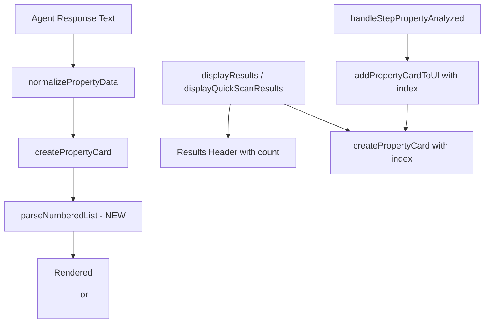

# Design Document: Analysis UX Improvements

## Overview

This design addresses two frontend improvements to the CloudFormation Security Analyzer results display:

1. **Numbered list formatting**: Parse recommendation and best practices text that contains numbered items (e.g., "1. Do X 2. Do Y") and render them as proper `<ol>` HTML lists instead of a single paragraph.
2. **Property count and numbering**: Show the total property count in the results header and prefix each property card title with its sequential number.

Both changes are purely frontend (`frontend/app.js`). No backend, infrastructure, or agent changes are required.

## Architecture

The changes are localized to three areas in `frontend/app.js`:



There are two rendering paths that need updating:
- **Batch rendering**: `displayResults()` and `displayQuickScanResults()` render all cards at once after analysis completes. The index is available from the `forEach` loop.
- **Incremental rendering**: `handleStepPropertyAnalyzed()` → `addPropertyCardToUI()` renders cards one at a time via WebSocket. The index comes from `detail.index` in the WebSocket message, or from a counter tracking arrival order.

## Components and Interfaces

### 1. `parseNumberedList(text)` — New Function

A utility function that detects numbered items in a text string and returns either an `<ol>` HTML string or a plain `<p>` string.

**Input**: A string that may contain patterns like `"1. First item 2. Second item 3. Third item"` or `"1. First item\n2. Second item"`.

**Detection logic**: Split on the regex pattern `/\d+\.\s/` (a digit followed by a dot and whitespace). If 2 or more items are found, render as `<ol>`. Otherwise, render as `<p>`.

```javascript
function parseNumberedList(text) {
    if (!text) return '';
    
    // Split on numbered item boundaries: "1. ", "2. ", etc.
    // Match patterns like "1. text", handling both inline and newline-separated
    const items = text.split(/(?:^|\s)(?=\d+\.\s)/).filter(s => s.trim());
    
    if (items.length >= 2) {
        const listItems = items.map(item => {
            // Remove the leading "N. " prefix
            const cleaned = item.replace(/^\d+\.\s*/, '').trim();
            return `<li>${cleaned}</li>`;
        });
        return `<ol class="list-decimal list-inside space-y-1 text-sm text-gray-700">${listItems.join('')}</ol>`;
    }
    
    // Not a numbered list — return as paragraph
    return `<span>${text}</span>`;
}
```

### 2. `createPropertyCard(property, index)` — Modified Function

Add an optional `index` parameter (0-based). When provided, prefix the property name with `{index + 1}.` in the card title.

**Current signature**: `createPropertyCard(property)`
**New signature**: `createPropertyCard(property, index)`

Changes inside the function:
- Title line: `${typeof index === 'number' ? (index + 1) + '. ' : ''}${property.name || 'Unknown Property'}`
- Recommendation section: Replace raw text interpolation with `parseNumberedList(property.secure_configuration || property.recommendation)`
- Best practices section: Add a new section that renders `property.best_practices` (array or text) using `parseNumberedList()` if present.

### 3. `displayResults(results)` — Modified Function

Already shows property count in the header (`Found ${properties.length} security-relevant properties`). Changes:
- Pass the loop index to `createPropertyCard(normalized, index)` in the `forEach` call.

### 4. `displayQuickScanResults(results)` — Modified Function

Already shows property count in the header (`Found ${properties.length} security-critical properties`). Changes:
- Pass the loop index to `createPropertyCard({...}, index)` in the `forEach` call.

### 5. `addPropertyCardToUI(property, index)` — Modified Function

Add an `index` parameter and pass it through to `createPropertyCard`.

**Current signature**: `addPropertyCardToUI(property)`
**New signature**: `addPropertyCardToUI(property, index)`

### 6. `handleStepPropertyAnalyzed(data)` — Modified Function

The WebSocket message already contains `detail.index` (0-based, from the Step Functions Map state). Pass this through to `addPropertyCardToUI(property, index)`.

### 7. Results Header in `addPropertyCardToUI`

When `addPropertyCardToUI` creates the results container for the first time (incremental rendering path), it currently shows a generic header without a count. Since the total is not known upfront during incremental rendering, the header will show "Security Analysis Results" initially. The count will be updated when `displayResults()` runs at the end (it already shows the count). This avoids complexity of predicting the total count during streaming.

## Data Models

No new data models. The existing property data structure from `normalizePropertyData()` already contains:
- `name`: string — property name
- `recommendation`: string — recommendation text (may contain numbered items)
- `secure_configuration`: string — secure config text (may contain numbered items)
- `best_practices`: array or string — best practices (may be an array of strings or a single text with numbered items)
- `risk_level`: string — risk level
- `security_impact`: string — security impact description

The `best_practices` field from the agent response is already extracted by `normalizePropertyData()` as `analysis.bestPractices || []`. When it's an array, each element becomes a list item. When it's a string with numbered items, `parseNumberedList()` handles it.


## Correctness Properties

*A property is a characteristic or behavior that should hold true across all valid executions of a system — essentially, a formal statement about what the system should do. Properties serve as the bridge between human-readable specifications and machine-verifiable correctness guarantees.*

### Property 1: Numbered text produces ordered list with correct item count

*For any* string containing N numbered items (where N ≥ 2) matching the pattern `"1. text 2. text ... N. text"`, `parseNumberedList` SHALL return an HTML string containing exactly one `<ol>` element with exactly N `<li>` elements, and each `<li>` SHALL contain the text of the corresponding item without the leading number prefix.

**Validates: Requirements 1.1, 1.2**

### Property 2: Non-numbered text produces plain text (no list)

*For any* string that does not contain 2 or more numbered item patterns (digit + dot + space), `parseNumberedList` SHALL return an HTML string that does not contain `<ol>` or `<li>` elements.

**Validates: Requirements 1.3**

### Property 3: Property card title includes sequential number

*For any* property object and any non-negative integer index, `createPropertyCard(property, index)` SHALL produce a card where the title text starts with `"{index + 1}. "` followed by the property name.

**Validates: Requirements 2.2**

## Error Handling

- **Empty/null text**: `parseNumberedList` returns an empty string for null, undefined, or empty string input. The Property_Card template conditionally renders the recommendation/best practices section only when content is non-empty.
- **Malformed numbered text**: If text contains only one numbered item (e.g., "1. Single item"), it is treated as plain text (not a list), since a single-item list provides no readability benefit.
- **Missing index**: If `createPropertyCard` is called without an index parameter (undefined), the title renders without a number prefix, maintaining backward compatibility.
- **Best practices as array vs string**: `normalizePropertyData` already extracts `bestPractices` as an array. If it's an array, join items into a numbered string before passing to `parseNumberedList`. If it's already a string, pass directly.

## Testing Strategy

### Unit Tests

- Test `parseNumberedList` with specific examples: empty string, single sentence, two numbered items, five numbered items, items with newlines between them.
- Test `createPropertyCard` with and without index parameter to verify title rendering.
- Test edge cases: text with numbers that aren't list items (e.g., "There are 3 options"), single-item "list", items with special characters.

### Property-Based Tests

Use `fast-check` (JavaScript property-based testing library) since the code under test is vanilla JS.

- **Property 1** (Feature: analysis-ux-improvements, Property 1: Numbered text produces ordered list with correct item count): Generate random arrays of 2-20 non-empty strings, format them as `"1. item1 2. item2 ..."`, pass to `parseNumberedList`, verify the output contains exactly one `<ol>` with the correct number of `<li>` elements. Minimum 100 iterations.
- **Property 2** (Feature: analysis-ux-improvements, Property 2: Non-numbered text produces plain text): Generate random strings that do not contain the pattern `\d+\.\s`, pass to `parseNumberedList`, verify the output does not contain `<ol>` or `<li>`. Minimum 100 iterations.
- **Property 3** (Feature: analysis-ux-improvements, Property 3: Property card title includes sequential number): Generate random property objects (with random name strings) and random non-negative integer indices, call `createPropertyCard`, verify the title element text starts with `"{index+1}. "`. Minimum 100 iterations.

Each property test must be annotated with a comment referencing the design property:
```javascript
// Feature: analysis-ux-improvements, Property 1: Numbered text produces ordered list with correct item count
```
