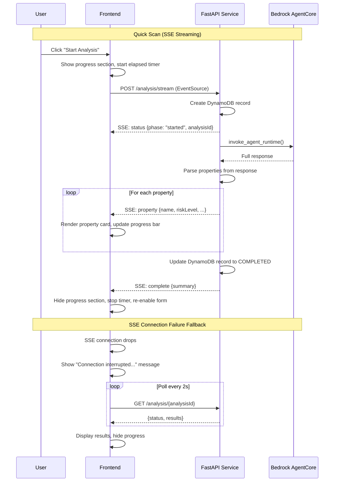
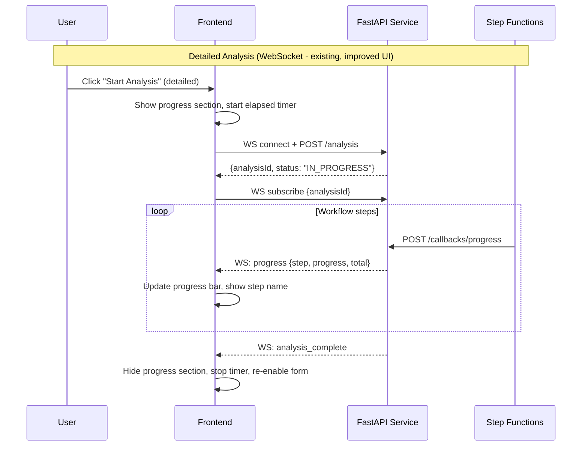

# Design Document: Analysis UX Improvements

## Overview

This design addresses three UX problems in the CloudFormation Security Analyzer frontend: (1) the progress section not hiding after completion, (2) no feedback during the 10-15 second quick scan wait, and (3) weak progress indicators. The solution introduces a Server-Sent Events (SSE) streaming endpoint on the FastAPI backend for quick scans, an elapsed timer, pulsing animations, rotating status messages, and proper UI state cleanup after analysis completion.

The key architectural addition is a new `POST /analysis/stream` SSE endpoint that wraps the existing `invoke_quick_scan_agent` call and streams parsed property results one at a time. The frontend switches from the synchronous REST call to this SSE endpoint for quick scans, rendering each property card as it arrives. Detailed analysis continues to use the existing WebSocket-based progress updates with improved frontend handling.

## Architecture





## Components and Interfaces

### 1. SSE Streaming Endpoint (`service/routers/analysis.py`)

A new `POST /analysis/stream` endpoint added to the existing analysis router. It reuses the existing `create_analysis_record`, `invoke_quick_scan_agent`, and `update_analysis_status` helper functions.

```python
from fastapi.responses import StreamingResponse

@router.post("/analysis/stream")
async def stream_analysis(request: AnalysisRequest):
    """SSE endpoint for streaming quick scan results."""
    analysis_id = str(uuid.uuid4())
    resource_url = str(request.resourceUrl)

    async def event_generator():
        # Emit started event
        yield sse_event("status", {"phase": "started", "analysisId": analysis_id})

        try:
            create_analysis_record(analysis_id, resource_url, "quick")
            agent_result = invoke_quick_scan_agent(analysis_id, resource_url)
            properties = parse_properties(agent_result)

            for i, prop in enumerate(properties):
                yield sse_event("property", {
                    "index": i,
                    "total": len(properties),
                    **prop
                })

            update_analysis_status(analysis_id, "COMPLETED", results=agent_result)
            yield sse_event("complete", {
                "analysisId": analysis_id,
                "totalProperties": len(properties)
            })
        except Exception as exc:
            update_analysis_status(analysis_id, "FAILED", error=str(exc))
            yield sse_event("error", {"message": str(exc)})

    return StreamingResponse(
        event_generator(),
        media_type="text/event-stream",
        headers={"Cache-Control": "no-cache", "X-Accel-Buffering": "no"}
    )
```

The `sse_event` helper formats data as SSE:

```python
def sse_event(event_type: str, data: dict) -> str:
    return f"event: {event_type}\ndata: {json.dumps(data)}\n\n"
```

The `parse_properties` helper extracts the properties array from the agent response, handling the various response formats the agent may return (JSON with `properties` key, raw text with embedded JSON, etc.). This logic is extracted from the existing `displayQuickScanResults` frontend function into the backend.

### 2. Frontend SSE Client (`frontend/app.js`)

The `startAnalysis` function is modified to use `fetch` with streaming for quick scans. Since SSE via `EventSource` only supports GET, and we need POST, we use `fetch` with a readable stream and parse SSE events manually.

```javascript
async function startQuickScanSSE(url) {
    const response = await fetch(`${CONFIG.API_BASE_URL}/analysis/stream`, {
        method: 'POST',
        headers: { 'Content-Type': 'application/json' },
        body: JSON.stringify({ resourceUrl: url, analysisType: 'quick' })
    });

    const reader = response.body.getReader();
    const decoder = new TextDecoder();
    let buffer = '';

    while (true) {
        const { done, value } = await reader.read();
        if (done) break;
        buffer += decoder.decode(value, { stream: true });

        // Parse SSE events from buffer
        const events = parseSSEEvents(buffer);
        buffer = events.remaining;

        for (const event of events.parsed) {
            handleSSEEvent(event);
        }
    }
}
```

### 3. Elapsed Timer (`frontend/app.js`)

A simple `setInterval`-based timer that starts when analysis begins and stops on completion/error.

```javascript
let elapsedTimerInterval = null;
let elapsedSeconds = 0;

function startElapsedTimer() {
    elapsedSeconds = 0;
    updateElapsedDisplay();
    elapsedTimerInterval = setInterval(() => {
        elapsedSeconds++;
        updateElapsedDisplay();
    }, 1000);
}

function stopElapsedTimer() {
    if (elapsedTimerInterval) {
        clearInterval(elapsedTimerInterval);
        elapsedTimerInterval = null;
    }
}
```

### 4. Rotating Status Messages (`frontend/app.js`)

A message rotator that cycles through contextual messages every 3 seconds during quick scan.

```javascript
const QUICK_SCAN_MESSAGES = [
    "Connecting to security agent...",
    "Analyzing resource properties...",
    "Evaluating security configurations...",
    "Checking compliance requirements...",
    "Assessing risk levels..."
];

let messageRotatorInterval = null;
let messageIndex = 0;

function startMessageRotator() {
    messageIndex = 0;
    messageRotatorInterval = setInterval(() => {
        messageIndex = (messageIndex + 1) % QUICK_SCAN_MESSAGES.length;
        progressText.textContent = QUICK_SCAN_MESSAGES[messageIndex];
    }, 3000);
}
```

### 5. Pulsing Animation (`frontend/styles.css`)

A CSS animation applied to the Progress_Section during quick scan.

```css
.pulse-bg {
    animation: pulseBg 2s ease-in-out infinite;
}

@keyframes pulseBg {
    0%, 100% { background-color: #ffffff; }
    50% { background-color: #f0f7ff; }
}
```

### 6. SSE Fallback Polling (`frontend/app.js`)

If the SSE connection drops before the `complete` event, the frontend falls back to polling.

```javascript
function startFallbackPolling(analysisId) {
    addActivityLogEntry('⚠️ Connection interrupted', 'Checking for results...', 'info');
    const pollInterval = setInterval(async () => {
        const response = await fetch(`${CONFIG.API_BASE_URL}/analysis/${analysisId}`);
        const data = await response.json();
        if (data.status === 'COMPLETED' || data.status === 'FAILED') {
            clearInterval(pollInterval);
            if (data.status === 'COMPLETED') {
                displayQuickScanResults(data.results);
            } else {
                showError(data.error || 'Analysis failed');
            }
            hideProgressSection();
        }
    }, 2000);
}
```

### 7. UI State Management Updates (`frontend/app.js`)

The core fix for the progress section not hiding. A centralized `hideProgressSection` function is called in all completion paths:

```javascript
function hideProgressSection() {
    progressSection.classList.add('hidden');
    stopElapsedTimer();
    stopMessageRotator();
    analyzeBtn.disabled = false;
    analyzeBtn.innerHTML = '<i class="fas fa-search mr-2"></i>Start Security Analysis';
}
```

This is called from:
- `handleSSEEvent` when `complete` event is received
- `handleSSEEvent` when `error` event is received
- `handleAnalysisComplete` for detailed analysis WebSocket completion
- `handleError` for WebSocket errors
- Fallback polling when status is COMPLETED or FAILED

## Data Models

### SSE Event Format

Each SSE event follows the standard format:

```
event: <event_type>
data: <json_payload>

```

Event types and payloads:

| Event Type | Payload | Description |
|---|---|---|
| `status` | `{"phase": "started", "analysisId": "uuid"}` | Analysis has started, DynamoDB record created |
| `property` | `{"index": 0, "total": 5, "name": "...", "riskLevel": "...", "securityImplication": "...", "recommendation": "..."}` | A single security property result |
| `complete` | `{"analysisId": "uuid", "totalProperties": 5}` | All properties emitted, analysis complete |
| `error` | `{"message": "error description"}` | Analysis failed |

### Property Data Shape (from SSE)

```typescript
interface StreamedProperty {
    index: number;        // 0-based position
    total: number;        // total properties count
    name: string;         // property name
    riskLevel: string;    // CRITICAL | HIGH | MEDIUM | LOW
    securityImplication: string;
    recommendation: string;
}
```

### Existing Models (Unchanged)

The `AnalysisRequest`, `AnalysisResponse`, and DynamoDB schemas remain unchanged. The SSE endpoint reuses `AnalysisRequest` for its input and the same DynamoDB record structure for persistence.


## Correctness Properties

*A property is a characteristic or behavior that should hold true across all valid executions of a system — essentially, a formal statement about what the system should do. Properties serve as the bridge between human-readable specifications and machine-verifiable correctness guarantees.*

Based on the prework analysis and property reflection, the following consolidated properties cover all testable acceptance criteria:

### Property 1: Completion hides progress and re-enables form

*For any* analysis completion — whether success or failure, via SSE (quick scan) or WebSocket (detailed analysis) — the Progress_Section shall have the `hidden` class, the elapsed timer shall be stopped, and the submit button shall be enabled with its original text.

**Validates: Requirements 1.1, 1.2, 1.3, 2.9, 6.2, 6.3**

### Property 2: New analysis resets UI state

*For any* new analysis start (regardless of previous UI state), the Progress_Section shall be visible, the Results_Section shall be hidden with its inner HTML cleared, and the submit button shall be disabled.

**Validates: Requirements 1.4, 6.4**

### Property 3: SSE endpoint returns correct content type and headers

*For any* valid `AnalysisRequest` body sent via POST to `/analysis/stream`, the response shall have status code 200, content type `text/event-stream`, and a `Cache-Control: no-cache` header.

**Validates: Requirements 2.1, 2.2**

### Property 4: SSE event sequence for successful scan

*For any* successful quick scan where the Bedrock AgentCore agent returns N properties (N ≥ 0), the SSE stream shall contain exactly: one `status` event with `phase: "started"` first, then exactly N `property` events each with sequential `index` values from 0 to N-1 and `total` equal to N, then one `complete` event with `totalProperties` equal to N last.

**Validates: Requirements 2.3, 2.4, 2.5**

### Property 5: SSE error event on agent failure

*For any* request to `/analysis/stream` where the Bedrock AgentCore invocation raises an exception, the SSE stream shall contain a `status` event followed by an `error` event with a non-empty `message` field, and the DynamoDB analysis record status shall be `FAILED`.

**Validates: Requirements 2.6**

### Property 6: Property card rendering from events

*For any* SSE `property` event received by the Frontend, a property card element shall be appended to the Results_Section containing the property's `name`, `riskLevel`, `securityImplication`, and `recommendation` text.

**Validates: Requirements 2.8**

### Property 7: Progress bar calculation from index and total

*For any* progress update containing an `index` i and `total` n (where 0 ≤ i < n and n > 0), the progress bar width shall be set to `Math.round(((i + 1) / n) * 100)` percent. This applies to both SSE property events (quick scan) and WebSocket property_complete events (detailed analysis).

**Validates: Requirements 4.3, 4.5**

### Property 8: Elapsed timer format

*For any* non-negative integer number of elapsed seconds s, the Elapsed_Timer display text shall match the format `Elapsed: {s}s`.

**Validates: Requirements 3.1**

### Property 9: WebSocket step display

*For any* WebSocket progress message containing a `step` or `message` field, the Progress_Section text shall be updated to display that step/message string.

**Validates: Requirements 4.4**

## Error Handling

### SSE Stream Errors

| Scenario | Behavior |
|---|---|
| AgentCore invocation fails | Emit `error` SSE event with message, update DynamoDB to FAILED, close stream |
| Invalid request body | Return 422 (Pydantic validation error), no SSE stream opened |
| DynamoDB write fails during record creation | Emit `error` SSE event, close stream |
| Client disconnects mid-stream | Server-side generator completes silently; DynamoDB record still updated |

### SSE Connection Resilience (Frontend)

| Scenario | Behavior |
|---|---|
| SSE connection drops before `complete` | Display "Connection interrupted, checking for results..." in Activity_Log, start polling `GET /analysis/{analysisId}` every 2 seconds |
| Polling returns COMPLETED | Display results, hide progress section, stop polling |
| Polling returns FAILED | Display error, hide progress section, stop polling |
| Polling returns non-terminal status after 60 seconds | Show timeout warning in Activity_Log |

### Existing Error Handling (Unchanged)

- WebSocket errors: stale connections cleaned up by ConnectionManager on send failure
- REST endpoint errors: 400/404/500 responses with JSON error body
- Form validation: empty URL rejected client-side before any API call

## Testing Strategy

### Unit Tests

Unit tests use `pytest`, `httpx.AsyncClient` (FastAPI TestClient), and `moto` for AWS mocking:

**Backend (Python)**:
- SSE endpoint: valid request returns event-stream content type, events are well-formed SSE format, error path emits error event
- `parse_properties` helper: various agent response formats (JSON with properties key, raw text with embedded JSON, empty response)
- `sse_event` helper: correct SSE formatting with event type and JSON data
- DynamoDB record creation and status updates during SSE flow

**Frontend (JavaScript)**:
- `parseSSEEvents`: correctly splits SSE buffer into individual events
- `hideProgressSection`: sets hidden class, stops timer, re-enables button
- `startElapsedTimer` / `stopElapsedTimer`: timer starts and stops correctly
- `handleSSEEvent`: routes events to correct handlers
- Fallback polling: triggers on connection drop, stops on terminal status

### Property-Based Tests

Property-based tests use `hypothesis` (Python) for backend properties. Each test runs minimum 100 iterations.

- **Property 3** (SSE content type): Generate random valid URLs, POST to `/analysis/stream`, verify response headers.
  - Tag: **Feature: analysis-ux-improvements, Property 3: SSE endpoint returns correct content type and headers**

- **Property 4** (SSE event sequence): Generate random agent responses with 0-20 properties, verify event sequence order and counts.
  - Tag: **Feature: analysis-ux-improvements, Property 4: SSE event sequence for successful scan**

- **Property 5** (SSE error event): Generate random valid requests with injected agent failures, verify error event and FAILED status.
  - Tag: **Feature: analysis-ux-improvements, Property 5: SSE error event on agent failure**

- **Property 7** (Progress bar calculation): Generate random (index, total) pairs where 0 ≤ index < total, verify percentage calculation.
  - Tag: **Feature: analysis-ux-improvements, Property 7: Progress bar calculation from index and total**

- **Property 8** (Elapsed timer format): Generate random non-negative integers, verify format string matches `Elapsed: {s}s`.
  - Tag: **Feature: analysis-ux-improvements, Property 8: Elapsed timer format**

### Frontend Testing Note

Properties 1, 2, 6, and 9 involve DOM manipulation in vanilla JS. These are best validated through unit tests with a DOM testing library (e.g., jsdom) rather than property-based tests, since the frontend has no build step or test framework currently. The backend property tests provide the strongest correctness guarantees for the SSE streaming logic.

### Test Configuration

- Framework: `pytest` with `pytest-asyncio`
- PBT library: `hypothesis`
- HTTP testing: `httpx` (FastAPI TestClient)
- AWS mocking: `moto` for DynamoDB, `unittest.mock` for Bedrock AgentCore
- Minimum PBT iterations: 100 per property (`@settings(max_examples=100)`)
