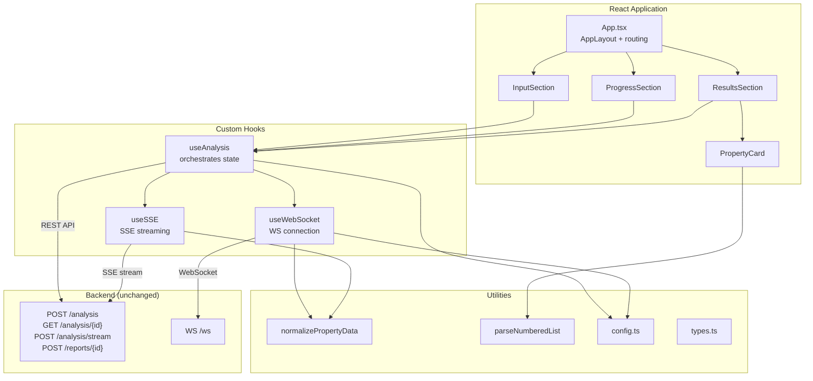

# Design Document: Cloudscape Frontend Migration

## Overview

This design describes the migration of the CloudFormation Security Analyzer frontend from vanilla HTML/JS/CSS to a React 18 + TypeScript application using the Cloudscape Design System. The application is built with Vite and deployed as static files to S3 + CloudFront. The backend (FastAPI on EKS) remains unchanged — only the frontend is replaced.

The architecture follows a hooks-based pattern where all business logic lives in custom React hooks (`useAnalysis`, `useWebSocket`, `useSSE`), and UI components are purely presentational, consuming Cloudscape components. Utility functions (`normalizePropertyData`, `parseNumberedList`) are ported from the existing `app.js` with TypeScript types.

## Architecture



### Data Flow

1. User enters URL and selects analysis type in InputSection
2. InputSection calls `useAnalysis.startAnalysis(url, type)`
3. For quick scan: `useAnalysis` delegates to `useSSE`, which POSTs to `/analysis/stream` and reads the SSE stream
4. For detailed analysis: `useAnalysis` delegates to `useWebSocket` to connect, then POSTs to `/analysis`, then subscribes via WebSocket
5. As properties arrive (via SSE events or WebSocket messages), they are normalized via `normalizePropertyData` and added to state
6. React re-renders ProgressSection and ResultsSection as state updates
7. On completion, final results are fetched (detailed only) and displayed

## Components and Interfaces

### App.tsx

The root component. Uses Cloudscape `AppLayout` for the page shell.

```tsx
import AppLayout from "@cloudscape-design/components/app-layout";
import BreadcrumbGroup from "@cloudscape-design/components/breadcrumb-group";
import SpaceBetween from "@cloudscape-design/components/space-between";

function App() {
  const analysis = useAnalysis();

  return (
    <AppLayout
      breadcrumbs={<BreadcrumbGroup items={[
        { text: "CloudFormation Security Analyzer", href: "#" }
      ]} />}
      content={
        <SpaceBetween size="l">
          <InputSection analysis={analysis} />
          {analysis.status === "in_progress" && <ProgressSection analysis={analysis} />}
          {analysis.results.length > 0 && <ResultsSection analysis={analysis} />}
        </SpaceBetween>
      }
      navigationHide
      toolsHide
    />
  );
}
```

### InputSection.tsx

Renders the URL input form with analysis type selector.

```tsx
interface InputSectionProps {
  analysis: UseAnalysisReturn;
}

// Cloudscape components used:
// - Container, Header, FormField, Input, Button, SegmentedControl, SpaceBetween
```

Key behaviors:
- URL validation on submit (empty/whitespace check)
- SegmentedControl toggles between "quick" and "detailed"
- Button disabled while `analysis.status === "in_progress"`

### ProgressSection.tsx

Displays progress bar and activity log during analysis.

```tsx
interface ProgressSectionProps {
  analysis: UseAnalysisReturn;
}

// Cloudscape components used:
// - Container, Header, ProgressBar, Table, Box
```

Key behaviors:
- ProgressBar value bound to `analysis.progress`
- Table displays `analysis.activityLog` entries with columns: timestamp, title, details
- Elapsed timer displayed in the header, incremented via `useEffect` with `setInterval`

### ResultsSection.tsx

Displays severity summary, risk filter, property cards grid, and PDF report button.

```tsx
interface ResultsSectionProps {
  analysis: UseAnalysisReturn;
}

// Cloudscape components used:
// - Container, Header, KeyValuePairs, Badge, SegmentedControl, Button, Grid, SpaceBetween, Box
```

Key behaviors:
- KeyValuePairs shows counts per severity with color-coded Badges
- SegmentedControl filters cards by risk level
- Grid renders PropertyCard components in responsive columns
- "Generate PDF Report" button calls `POST /reports/{analysisId}` and opens the returned URL

### PropertyCard.tsx

Renders a single security finding.

```tsx
interface PropertyCardProps {
  property: PropertyData;
  index: number;
}

// Cloudscape components used:
// - Container, Header, Badge, Box, SpaceBetween
```

Key behaviors:
- Header shows property name with risk Badge
- Body shows security_impact, key_threat (if present), recommendation
- Recommendation text processed through `parseNumberedList` for numbered list rendering

## Custom Hooks

### useAnalysis

The orchestrator hook. Manages all analysis state and coordinates sub-hooks.

```tsx
interface UseAnalysisReturn {
  // State
  status: "idle" | "in_progress" | "completed" | "failed";
  analysisId: string | null;
  results: PropertyData[];
  progress: number;
  progressMessage: string;
  activityLog: ActivityLogEntry[];
  error: string | null;
  analysisType: "quick" | "detailed";

  // Actions
  startAnalysis: (url: string, type: "quick" | "detailed") => Promise<void>;
  resetAnalysis: () => void;
}
```

Implementation approach:
- Uses `useReducer` for complex state transitions
- Calls `useWebSocket` for detailed analysis
- Calls `useSSE` for quick scan
- Fetches final results via REST for detailed analysis on completion

### useWebSocket

Manages WebSocket connection lifecycle for detailed analysis.

```tsx
interface UseWebSocketOptions {
  onCrawlComplete: (data: WebSocketMessage) => void;
  onPropertyAnalyzed: (property: PropertyData) => void;
  onComplete: (data: WebSocketMessage) => void;
  onError: (message: string) => void;
}

interface UseWebSocketReturn {
  connect: () => Promise<void>;
  subscribe: (analysisId: string) => void;
  disconnect: () => void;
  isConnected: boolean;
}
```

Implementation approach:
- Stores WebSocket instance in `useRef`
- Reconnection with exponential backoff (2s * attempt, up to maxReconnectAttempts)
- Message routing by `step` field: "crawl", "property_analyzed", "analyze", "complete"
- Falls back to `type`/`action` field routing for forward compatibility
- Normalizes property data via `normalizePropertyData` before invoking callbacks
- Cleanup on unmount via `useEffect` return

### useSSE

Manages SSE streaming for quick scan via fetch ReadableStream.

```tsx
interface UseSSEOptions {
  onStatus: (analysisId: string) => void;
  onProperty: (property: SSEPropertyEvent) => void;
  onComplete: (totalProperties: number) => void;
  onError: (message: string) => void;
}

interface UseSSEReturn {
  startStream: (url: string) => Promise<void>;
  isStreaming: boolean;
}
```

Implementation approach:
- Uses `fetch` with `response.body.getReader()` to read SSE stream
- Parses SSE buffer: splits on `\n\n`, extracts `event:` and `data:` lines
- Routes events by type: "status", "property", "complete", "error"
- Fallback polling if stream ends without terminal event
- Tracks `sseReceivedTerminalEvent` via ref to avoid duplicate error handling
- Abortable via `AbortController` stored in ref

## Data Models

### PropertyData

```tsx
interface PropertyData {
  name: string;
  risk_level: "CRITICAL" | "HIGH" | "MEDIUM" | "LOW";
  description: string;
  security_impact: string;
  key_threat: string;
  secure_configuration: string;
  recommendation: string;
  property_path: string;
  best_practices: string[];
  common_misconfigurations: string[];
}
```

### AnalysisState

```tsx
interface AnalysisState {
  status: "idle" | "in_progress" | "completed" | "failed";
  analysisId: string | null;
  analysisType: "quick" | "detailed";
  results: PropertyData[];
  progress: number;
  progressMessage: string;
  activityLog: ActivityLogEntry[];
  error: string | null;
}
```

### ActivityLogEntry

```tsx
interface ActivityLogEntry {
  timestamp: string;
  title: string;
  details: string;
  type: "info" | "success" | "error";
}
```

### SSE Types

```tsx
interface SSEEvent {
  event: string;
  data: unknown;
}

interface SSEPropertyEvent {
  name: string;
  riskLevel: string;
  securityImplication: string;
  recommendation: string;
  index: number;
  total: number;
}
```

### WebSocket Types

```tsx
interface WebSocketMessage {
  step?: string;
  type?: string;
  action?: string;
  detail?: Record<string, unknown>;
  progress?: number;
  total?: number;
  error?: string;
  message?: string;
}
```

### Config Type

```tsx
interface AppConfig {
  API_BASE_URL: string;
  WEBSOCKET_URL: string;
  AUTH: {
    useIAM: boolean;
    useCognito: boolean;
  };
  FEATURES: {
    batchAnalysis: boolean;
    pdfReports: boolean;
    realtimeUpdates: boolean;
  };
  TIMEOUTS: {
    analysisTimeout: number;
    websocketTimeout: number;
    maxReconnectAttempts: number;
  };
}
```


## Correctness Properties

*A property is a characteristic or behavior that should hold true across all valid executions of a system — essentially, a formal statement about what the system should do. Properties serve as the bridge between human-readable specifications and machine-verifiable correctness guarantees.*

### Property 1: Whitespace URL rejection

*For any* string composed entirely of whitespace characters (including empty string), submitting it as the URL input should be rejected with a validation error, and no analysis should be started.

**Validates: Requirements 3.5**

### Property 2: WebSocket message routing

*For any* WebSocket message containing a known `step` field ("crawl", "property_analyzed", "complete") or `type` field ("error"), the useWebSocket hook should invoke exactly the corresponding callback (onCrawlComplete, onPropertyAnalyzed, onComplete, or onError respectively) with the message data.

**Validates: Requirements 5.2, 5.3, 5.4, 5.5**

### Property 3: SSE event routing

*For any* parsed SSE event with a known event type ("status", "property", "complete", "error"), the useSSE hook should invoke exactly the corresponding callback (onStatus, onProperty, onComplete, or onError respectively) with the event data.

**Validates: Requirements 6.2, 6.3, 6.4, 6.5**

### Property 4: SSE buffer parsing

*For any* well-formed SSE buffer consisting of event blocks separated by double newlines, where each block contains an `event:` line and a `data:` line with valid JSON, parsing the buffer should produce an array of SSEEvent objects with the correct event type and parsed data, plus any remaining incomplete buffer text.

**Validates: Requirements 6.7**

### Property 5: Severity count accuracy

*For any* array of PropertyData objects, the severity summary counts (Critical, High, Medium, Low) should equal the actual count of properties with each respective risk_level in the array.

**Validates: Requirements 8.2**

### Property 6: Risk level filtering

*For any* array of PropertyData objects and any selected risk level filter (All, Critical, High, Medium, Low), the filtered result should contain exactly the properties matching that risk level, or all properties when "All" is selected.

**Validates: Requirements 8.4**

### Property 7: PropertyCard field rendering

*For any* PropertyData object, the rendered PropertyCard should display the property name, a Badge with the correct risk level, and the security_impact text. When key_threat is non-empty, it should appear in the rendered output. When recommendation is non-empty, it should appear in the rendered output.

**Validates: Requirements 9.1, 9.2, 9.3, 9.4, 9.5**

### Property 8: Normalizer format handling

*For any* raw property object in any of the known API formats (DynamoDB `propertyResult.Payload` wrapper, WebSocket `result` wrapper, direct object, or text with embedded JSON), normalizePropertyData should return an object with all required PropertyData fields (name, risk_level, security_impact, recommendation) populated from the input data.

**Validates: Requirements 10.1, 10.2**

### Property 9: Normalizer idempotence

*For any* PropertyData object that is already normalized (has `name` and `risk_level` at top level), calling normalizePropertyData should return an equivalent object — i.e., `normalizePropertyData(normalizePropertyData(x))` equals `normalizePropertyData(x)`.

**Validates: Requirements 10.3**

### Property 10: Parser numbered list extraction

*For any* text string containing two or more numbered items in "N. text" or "N) text" format, parseNumberedList should return a structured list with the same number of items, each containing the text after the number prefix. For text without numbered patterns, it should return the original text unchanged.

**Validates: Requirements 10.4**

## Error Handling

### Network Errors
- REST API failures (fetch rejects or non-2xx status): Set analysis status to "failed", store error message, re-enable the submit button.
- WebSocket connection failure: Reject the connect promise, propagate error to useAnalysis which sets status to "failed".
- SSE stream failure: If no terminal event received and analysisId exists, fall back to polling. If no analysisId, show error directly.

### WebSocket Reconnection
- On unexpected close: Retry with exponential backoff (2s × attempt number), up to `maxReconnectAttempts` (default 5).
- On intentional disconnect (user calls disconnect): No reconnection.

### SSE Fallback
- If stream ends without "complete" or "error" event: Start polling `GET /analysis/{analysisId}` every 2 seconds.
- Polling continues until status is COMPLETED (display results) or FAILED (show error).

### Data Parsing Errors
- normalizePropertyData: If JSON extraction from embedded text fails, fall back to empty analysis object with defaults (name="Unknown Property", risk_level="MEDIUM").
- parseNumberedList: If input is null/empty, return empty string. If no numbered pattern detected, return original text wrapped in a span.

### UI Error Display
- Errors shown via a dismissible alert at the top of the page (auto-dismiss after 5 seconds).
- Progress section hidden on error, submit button re-enabled.

## Testing Strategy

### Testing Framework
- **Unit/Component tests**: `vitest` + `@testing-library/react` + `jsdom`
- **Property-based tests**: `fast-check` (JavaScript/TypeScript PBT library)
- Each property-based test runs a minimum of 100 iterations

### Unit Tests
Unit tests cover specific examples, edge cases, and component rendering:
- InputSection renders all Cloudscape components correctly
- ProgressSection displays progress bar and activity log table
- ResultsSection renders severity summary and filter controls
- PropertyCard renders with various risk levels
- Config module returns correct URLs for localhost vs production
- useAnalysis initial state shape
- useWebSocket reconnection behavior
- useSSE fallback polling behavior

### Property-Based Tests
Each correctness property from the design is implemented as a single property-based test using `fast-check`:

- **Feature: cloudscape-frontend-migration, Property 1: Whitespace URL rejection** — Generate arbitrary whitespace strings, verify rejection
- **Feature: cloudscape-frontend-migration, Property 2: WebSocket message routing** — Generate random WebSocket messages with known step/type fields, verify correct callback invocation
- **Feature: cloudscape-frontend-migration, Property 3: SSE event routing** — Generate random SSE events with known types, verify correct callback invocation
- **Feature: cloudscape-frontend-migration, Property 4: SSE buffer parsing** — Generate random well-formed SSE buffers, verify parsing produces correct event objects
- **Feature: cloudscape-frontend-migration, Property 5: Severity count accuracy** — Generate random arrays of PropertyData, verify computed counts match actual distribution
- **Feature: cloudscape-frontend-migration, Property 6: Risk level filtering** — Generate random PropertyData arrays and filter selections, verify filtered output
- **Feature: cloudscape-frontend-migration, Property 7: PropertyCard field rendering** — Generate random PropertyData objects, verify rendered output contains expected fields
- **Feature: cloudscape-frontend-migration, Property 8: Normalizer format handling** — Generate raw property objects in various API formats, verify normalized output has all required fields
- **Feature: cloudscape-frontend-migration, Property 9: Normalizer idempotence** — Generate random PropertyData, verify normalizePropertyData is idempotent
- **Feature: cloudscape-frontend-migration, Property 10: Parser numbered list extraction** — Generate strings with numbered items, verify extraction produces correct item count and content
