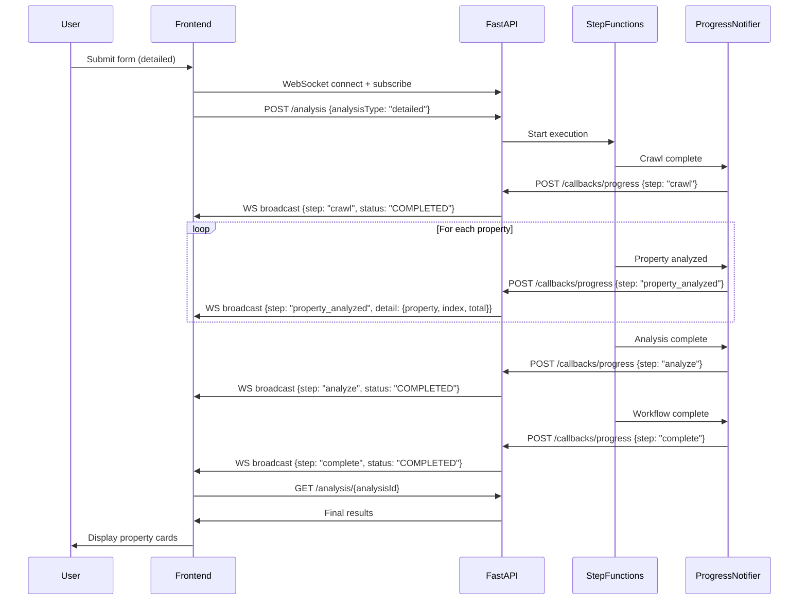

# Design Document: Detailed Analysis Fix

## Overview

This design addresses two frontend issues and one infrastructure enhancement for the CloudFormation Security Analyzer:

1. The frontend `handleWebSocketMessage()` function does not recognize the `{step, status, detail}` message format sent by the backend via WebSocket during detailed analysis. It expects `{type}` or `{action}` fields, causing all progress messages to fall through to the `default` case and the UI to remain stuck at 0%.

2. The UI has no analysis type selector — the form always triggers a quick scan. Users need a way to choose between quick scan and detailed analysis.

3. The Step Functions Map state does not send per-property progress notifications. To match the quick scan's incremental UX, the Map iterator needs a progress notification step after each property analysis.

The fix is primarily frontend-focused (Issues 1 & 2) with a targeted CDK infrastructure change (Issue 3). The backend FastAPI service is not modified.

## Architecture

The detailed analysis data flow is:



### Change Scope

| Component | File | Change |
|-----------|------|--------|
| Frontend JS | `frontend/app.js` | Update `handleWebSocketMessage()` to recognize `step` field; add step-specific handlers; implement `displayResults()` for detailed results; pass analysis type from form |
| Frontend HTML | `frontend/index.html` | Add analysis type selector (radio buttons) to the form |
| Frontend CSS | `frontend/styles.css` | Add styles for the analysis type selector |
| CDK Stack | `stacks/stepfunctions_stack.py` | Add per-property progress notification inside the Map iterator |

## Components and Interfaces

### Component 1: WebSocket Message Router (frontend/app.js)

The existing `handleWebSocketMessage(data)` function checks `data.type || data.action`. The fix adds a secondary check for `data.step` when the primary check yields no match.

```javascript
function handleWebSocketMessage(data) {
    // Existing type/action routing (for forward compatibility)
    const messageType = data.type || data.action;
    if (messageType) {
        switch (messageType) {
            case 'progress': return handleProgressUpdate(data);
            case 'property_complete': return handlePropertyComplete(data);
            case 'analysis_complete': return handleAnalysisComplete(data);
            case 'error': return handleError(data);
        }
    }

    // Backend step-based messages from Step Functions workflow
    const step = data.step;
    if (step) {
        switch (step) {
            case 'crawl': return handleStepCrawlComplete(data);
            case 'property_analyzed': return handleStepPropertyAnalyzed(data);
            case 'analyze': return handleStepAnalyzeComplete(data);
            case 'complete': return handleStepWorkflowComplete(data);
            default:
                console.log('Unknown step:', step, data);
                return;
        }
    }

    console.log('Unrecognized WebSocket message:', data);
}
```

### Component 2: Step-Based Message Handlers (frontend/app.js)

Four new handler functions for the backend message format:

**handleStepCrawlComplete(data)**: Updates progress to ~20%, adds activity log entry for crawl completion.

**handleStepPropertyAnalyzed(data)**: Extracts property result from `data.detail`, renders a property card incrementally (reusing `createPropertyCard()`), updates progress bar proportionally between 20-90% based on `detail.index` / `detail.total`.

**handleStepAnalyzeComplete(data)**: Updates progress to ~90%, adds activity log entry.

**handleStepWorkflowComplete(data)**: Updates progress to 100%, fetches final results via `GET /analysis/{analysisId}`, hides progress section, re-enables form.

### Component 3: displayResults() Implementation (frontend/app.js)

The existing `displayResults()` is a stub. It needs to handle the detailed analysis response format from `GET /analysis/{analysisId}`.

The DynamoDB record stores results as a JSON string in `results.S`. The response from `get_analysis` returns the raw DynamoDB item. The function must:

1. Parse `item.results.S` (JSON string) to extract the results object
2. Extract `results.properties` array — each element is a property analyzer Lambda response wrapped in a `Payload` key
3. Render property cards using the existing `createPropertyCard()` function
4. Only render cards that weren't already rendered incrementally via WebSocket

### Component 4: Analysis Type Selector (frontend/index.html + styles.css)

A pair of styled radio-button cards inserted into the form, between the URL input and the submit button:

```html
<div class="analysis-type-selector">
    <label class="analysis-type-option">
        <input type="radio" name="analysisType" value="quick">
        <div class="analysis-type-card">
            <div class="analysis-type-title">
                <i class="fas fa-bolt"></i> Quick Scan
            </div>
            <div class="analysis-type-desc">~30 seconds · Top 5-10 critical properties</div>
        </div>
    </label>
    <label class="analysis-type-option">
        <input type="radio" name="analysisType" value="detailed" checked>
        <div class="analysis-type-card">
            <div class="analysis-type-title">
                <i class="fas fa-microscope"></i> Detailed Analysis
            </div>
            <div class="analysis-type-desc">2-5 minutes · Comprehensive review of all properties</div>
        </div>
    </label>
</div>
```

The `handleFormSubmit()` function reads the selected radio value and passes it to `startAnalysis(url, analysisType)`.

### Component 5: Per-Property Progress Notification (stacks/stepfunctions_stack.py)

Inside the Map iterator, chain a progress notification step after `AnalyzeSingleProperty`:

```
AnalyzeSingleProperty → NotifyPropertyAnalyzed → (next iteration)
```

The `NotifyPropertyAnalyzed` step invokes the existing `progress_notifier` Lambda with:

```json
{
    "analysisId": "$.analysisId",
    "step": "property_analyzed",
    "status": "COMPLETED",
    "detail": {
        "property": "$.property",
        "result": "$.propertyResult.Payload",
        "index": "$$.Map.Item.Index",
        "total": "calculated from array length"
    }
}
```

The total property count is not directly available inside the Map iterator via `$$.Map.Item.*`. To work around this, we pass the total as an input parameter to the Map state by computing it before entering the Map.

A `Pass` state before the Map computes the total:
```json
{
    "totalProperties.$": "States.ArrayLength($.crawlResult.Payload.result.properties)"
}
```

This value is then passed into each Map iteration via the `parameters` block and forwarded to the notifier.

Error handling: The notification step uses `addCatch` with `States.ALL` to ignore failures, ensuring a failed notification does not break the property analysis pipeline.

## Data Models

### Backend WebSocket Message Format (existing, unchanged)

Messages broadcast via WebSocket from the callbacks router. The `updateData` dict is sent directly as the WebSocket JSON payload.

```python
# Crawl complete
{"step": "crawl", "status": "COMPLETED", "detail": {"message": "Documentation crawl completed"}}

# Per-property analyzed (NEW)
{"step": "property_analyzed", "status": "COMPLETED", "detail": {"property": {"name": "...", "description": "..."}, "result": {...}, "index": 0, "total": 15}}

# All properties analyzed
{"step": "analyze", "status": "COMPLETED", "detail": {"message": "Property analysis completed"}}

# Workflow complete
{"step": "complete", "status": "COMPLETED", "detail": {"message": "Detailed analysis workflow completed"}}
```

### GET /analysis/{analysisId} Response (existing, unchanged)

Returns the raw DynamoDB item:

```json
{
    "analysisId": "uuid",
    "status": "COMPLETED",
    "results": {
        "S": "{\"resourceType\": \"...\", \"properties\": [...], \"totalProperties\": 15}"
    },
    "completedAt": "2024-...",
    "updatedAt": "2024-..."
}
```

The `results.S` field is a JSON string (DynamoDB String attribute) containing the aggregated results. Each property in the `properties` array is the raw Lambda response from the property analyzer invoker.

### Analysis Type Selector State

The selected analysis type is read from the radio input:

```javascript
const analysisType = document.querySelector('input[name="analysisType"]:checked').value;
// "quick" or "detailed"
```


## Correctness Properties

*A property is a characteristic or behavior that should hold true across all valid executions of a system — essentially, a formal statement about what the system should do. Properties serve as the bridge between human-readable specifications and machine-verifiable correctness guarantees.*

### Property 1: Step-based message routing correctness

*For any* WebSocket message containing a `step` field with a value in `{"crawl", "property_analyzed", "analyze", "complete"}`, the `handleWebSocketMessage()` function shall invoke the corresponding step handler and no other handler.

**Validates: Requirements 1.1**

### Property 2: Unrecognized message resilience

*For any* arbitrary JSON object that does not contain a recognized `type`, `action`, or `step` field, the `handleWebSocketMessage()` function shall return without throwing an exception.

**Validates: Requirements 1.5**

### Property 3: Detailed results display completeness

*For any* valid results object containing an array of property objects, the `displayResults()` function shall create exactly one property card DOM element per property in the array, and each card shall contain the property's name and risk level.

**Validates: Requirements 2.2**

### Property 4: Per-property progress calculation

*For any* property index `i` (0-based) and total property count `n` (where 0 <= i < n and n > 0), the progress percentage computed during the `property_analyzed` step shall equal `Math.round(20 + ((i + 1) / n) * 70)`, producing values in the range [20, 90].

**Validates: Requirements 4.3**

### Property 5: Per-property notification payload completeness

*For any* property analyzed within the Step Functions Map state, the progress notification payload sent to the callbacks endpoint shall contain the fields `step` (equal to `"property_analyzed"`), `detail.property`, `detail.result`, `detail.index`, and `detail.total`.

**Validates: Requirements 5.1**

## Error Handling

| Scenario | Handling |
|----------|----------|
| WebSocket message with unknown `step` value | Log to console, no UI change, no exception |
| WebSocket message with no `type`, `action`, or `step` | Log to console, no UI change, no exception |
| `GET /analysis/{analysisId}` returns non-200 | Display error banner, re-enable form, hide progress |
| `GET /analysis/{analysisId}` returns malformed results | Display error banner, re-enable form, hide progress |
| Per-property progress notification Lambda fails | Step Functions catches error and continues to next property (existing catch pattern) |
| WebSocket disconnects during detailed analysis | Existing reconnect logic (up to 5 attempts with backoff) remains unchanged |

## Testing Strategy

### Unit Tests (pytest + JSDOM/manual verification)

**Frontend (manual or lightweight DOM tests):**
- Verify `handleWebSocketMessage()` routes `{step: "crawl"}` to `handleStepCrawlComplete`
- Verify `handleWebSocketMessage()` routes `{step: "complete"}` to `handleStepWorkflowComplete`
- Verify `handleFormSubmit()` reads the selected analysis type radio value
- Verify `displayResults()` handles missing/malformed `results.S` field gracefully
- Verify the analysis type selector defaults to "detailed"

**Backend/Infrastructure (pytest):**
- Verify the CDK-synthesized state machine definition includes `NotifyPropertyAnalyzed` inside the Map iterator
- Verify the `NotifyPropertyAnalyzed` step has a catch handler for `States.ALL`
- Verify the notification payload template includes `step: "property_analyzed"` and the required detail fields

### Property-Based Tests (hypothesis)

Property-based tests use the `hypothesis` library (already in `requirements-dev.txt`).

- **Property 1 test**: Generate random step values from the known set, call the message router, assert the correct handler was invoked (via mock). Minimum 100 iterations.
  - Tag: **Feature: detailed-analysis-fix, Property 1: Step-based message routing correctness**

- **Property 2 test**: Generate arbitrary JSON-like dicts (using `hypothesis.strategies.dictionaries`), call the message router, assert no exception is raised. Minimum 100 iterations.
  - Tag: **Feature: detailed-analysis-fix, Property 2: Unrecognized message resilience**

- **Property 3 test**: Generate random lists of property objects (with random names and risk levels), call `displayResults()` (or its pure logic equivalent), assert the output count matches input count and each card contains the property name. Minimum 100 iterations.
  - Tag: **Feature: detailed-analysis-fix, Property 3: Detailed results display completeness**

- **Property 4 test**: Generate random `(index, total)` pairs where `0 <= index < total` and `total > 0`, compute the expected progress percentage, assert it equals `round(20 + ((index + 1) / total) * 70)` and falls within [20, 90]. Minimum 100 iterations.
  - Tag: **Feature: detailed-analysis-fix, Property 4: Per-property progress calculation**

- **Property 5 test**: Generate random property dicts and index/total pairs, construct the notification payload as the CDK template would, assert all required fields are present. Minimum 100 iterations.
  - Tag: **Feature: detailed-analysis-fix, Property 5: Per-property notification payload completeness**

Since the frontend is vanilla JS (no build step, no Node test runner), the property-based tests for frontend logic (Properties 1-4) will be implemented in Python using `hypothesis`. The JavaScript functions' logic will be extracted into testable pure functions or tested via equivalent Python implementations that mirror the JS logic. Property 5 tests the CDK/infrastructure layer directly in Python.
