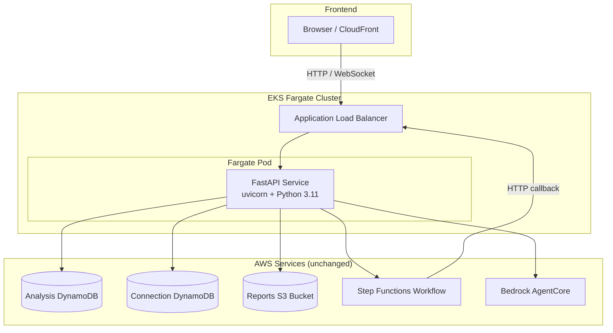

# Design Document: Lambda to EKS Fargate Migration

## Overview

This design describes the migration of the CloudFormation Security Analyzer from three AWS Lambda functions behind API Gateway to a single containerized FastAPI service running on Amazon EKS Fargate. The migration preserves all existing functionality while consolidating the codebase into a single deployable unit.

The key architectural change is replacing the Lambda + API Gateway compute/routing layer with a FastAPI container on EKS Fargate behind an Application Load Balancer. All backing services (DynamoDB, S3, Step Functions, Bedrock AgentCore) remain unchanged. The Step Functions workflow is updated to call the EKS service's HTTP endpoint for progress notifications instead of invoking a Lambda directly.

## Architecture



### Request Flow

1. Frontend sends HTTP/WebSocket requests to the ALB endpoint.
2. ALB routes to the FastAPI pod running on Fargate.
3. FastAPI handles the request using the same business logic as the original Lambdas.
4. For detailed analysis, FastAPI starts a Step Functions execution. The workflow calls back to the FastAPI service via the ALB to deliver progress updates.
5. FastAPI broadcasts progress updates to subscribed WebSocket clients.

### What Changes vs. What Stays

| Component | Before | After |
|---|---|---|
| Compute | 3 Lambda functions | 1 FastAPI container on EKS Fargate |
| Routing | REST API Gateway + WebSocket API Gateway | ALB Ingress Controller |
| WebSocket | API Gateway WebSocket API | Native FastAPI WebSocket |
| Progress notifications | Step Functions → Lambda invoke | Step Functions → HTTP call to ALB |
| AWS access | Lambda execution roles | IRSA (IAM Roles for Service Accounts) |
| CDK stacks | LambdaStack + ApiStack | EksStack |
| DynamoDB, S3, Step Functions, Bedrock | Unchanged | Unchanged |
| Frontend | Points to API Gateway URLs | Points to ALB URL |

## Components and Interfaces

### 1. FastAPI Application (`service/main.py`)

The entry point that creates the FastAPI app, registers routers, and configures CORS middleware.

```python
from fastapi import FastAPI
from fastapi.middleware.cors import CORSMiddleware
from service.routers import analysis, reports, websocket, health, callbacks

app = FastAPI(title="CloudFormation Security Analyzer")

app.add_middleware(
    CORSMiddleware,
    allow_origins=["*"],
    allow_methods=["*"],
    allow_headers=["Content-Type", "Authorization", "X-Amz-Date", "X-Api-Key", "X-Amz-Security-Token"],
)

app.include_router(health.router)
app.include_router(analysis.router)
app.include_router(reports.router)
app.include_router(websocket.router)
app.include_router(callbacks.router)
```

### 2. Analysis Router (`service/routers/analysis.py`)

Ports the logic from `lambda/analysis_orchestrator.py`. Two endpoints:

- `POST /analysis` — validates request, creates DynamoDB record, dispatches to quick scan (AgentCore) or detailed (Step Functions).
- `GET /analysis/{analysisId}` — retrieves analysis record from DynamoDB.

Key difference from Lambda: no API Gateway event parsing. FastAPI handles request/response serialization natively via Pydantic models.

```python
from fastapi import APIRouter, HTTPException
from pydantic import BaseModel, HttpUrl

router = APIRouter()

class AnalysisRequest(BaseModel):
    resourceUrl: HttpUrl
    analysisType: str = "quick"
    connectionId: str | None = None

@router.post("/analysis")
async def start_analysis(request: AnalysisRequest):
    # Validate analysisType
    # Create DynamoDB record
    # Dispatch to quick scan or Step Functions
    ...

@router.get("/analysis/{analysis_id}")
async def get_analysis(analysis_id: str):
    # Retrieve from DynamoDB
    ...
```

### 3. Reports Router (`service/routers/reports.py`)

Ports the logic from `lambda/report_generator.py`. Single endpoint:

- `POST /reports/{analysisId}` — fetches analysis results, generates PDF via ReportLab, uploads to S3, returns pre-signed URL.

The PDF generation logic (`generate_pdf_report`) is extracted unchanged from the Lambda. The S3 upload and pre-signed URL generation are identical.

### 4. WebSocket Router (`service/routers/websocket.py`)

Ports the logic from `lambda/websocket_handler.py`. Uses FastAPI's native WebSocket support:

```python
from fastapi import APIRouter, WebSocket, WebSocketDisconnect

router = APIRouter()

@router.websocket("/ws")
async def websocket_endpoint(ws: WebSocket):
    await ws.accept()
    connection_id = str(uuid.uuid4())
    # Store connection in DynamoDB
    try:
        while True:
            data = await ws.receive_json()
            # Handle subscribe, ping, etc.
    except WebSocketDisconnect:
        # Remove connection from DynamoDB
```

Key difference from Lambda: FastAPI manages the WebSocket lifecycle directly. No API Gateway Management API needed for sending messages — the service holds the live WebSocket objects in memory and sends directly.

#### In-Memory Connection Manager

Since the service runs as a single pod, an in-memory dict maps `connection_id` → `WebSocket` object. This allows direct message sending without the API Gateway Management API:

```python
class ConnectionManager:
    def __init__(self):
        self.active_connections: dict[str, WebSocket] = {}
        self.subscriptions: dict[str, set[str]] = {}  # analysisId -> set of connection_ids

    async def connect(self, connection_id: str, ws: WebSocket):
        self.active_connections[connection_id] = ws

    def disconnect(self, connection_id: str):
        self.active_connections.pop(connection_id, None)
        # Remove from subscriptions

    async def subscribe(self, connection_id: str, analysis_id: str):
        self.subscriptions.setdefault(analysis_id, set()).add(connection_id)

    async def broadcast(self, analysis_id: str, message: dict):
        connection_ids = self.subscriptions.get(analysis_id, set())
        stale = []
        for cid in connection_ids:
            ws = self.active_connections.get(cid)
            if ws:
                try:
                    await ws.send_json(message)
                except Exception:
                    stale.append(cid)
        for cid in stale:
            self.disconnect(cid)
```

DynamoDB Connection_Store is still written to for consistency with the existing data model and for potential multi-pod scaling in the future, but the primary send path uses the in-memory manager.

### 5. Callbacks Router (`service/routers/callbacks.py`)

New endpoint for Step Functions to deliver progress updates:

- `POST /callbacks/progress` — receives progress update payload, broadcasts to subscribed WebSocket connections.

```python
from fastapi import APIRouter
from pydantic import BaseModel

router = APIRouter()

class ProgressUpdate(BaseModel):
    analysisId: str
    updateData: dict

@router.post("/callbacks/progress")
async def receive_progress(update: ProgressUpdate):
    # Broadcast to subscribed WebSocket connections via ConnectionManager
    ...
```

### 6. Health Router (`service/routers/health.py`)

Simple health check:

```python
@router.get("/health")
async def health():
    return {"status": "healthy"}
```

### 7. AWS Clients Module (`service/aws_clients.py`)

Centralized boto3 client initialization. All routers import from here:

```python
import os
import boto3

dynamodb = boto3.resource("dynamodb")
analysis_table = dynamodb.Table(os.environ["ANALYSIS_TABLE_NAME"])
connection_table = dynamodb.Table(os.environ["CONNECTION_TABLE_NAME"])
s3_client = boto3.client("s3")
stepfunctions_client = boto3.client("stepfunctions")
bedrock_agentcore_client = boto3.client("bedrock-agentcore")

REPORTS_BUCKET_NAME = os.environ["REPORTS_BUCKET_NAME"]
STATE_MACHINE_ARN = os.environ.get("STATE_MACHINE_ARN", "")
PRESIGNED_URL_EXPIRY = int(os.environ.get("PRESIGNED_URL_EXPIRY", "3600"))
```

### 8. Dockerfile

```dockerfile
# Stage 1: Build
FROM python:3.11-slim AS builder
WORKDIR /app
COPY requirements.txt .
RUN pip install --no-cache-dir --target=/app/deps -r requirements.txt

# Stage 2: Runtime
FROM python:3.11-slim
RUN useradd --create-home appuser
WORKDIR /app
COPY --from=builder /app/deps /usr/local/lib/python3.11/site-packages/
COPY service/ ./service/
USER appuser
EXPOSE 8000
HEALTHCHECK --interval=30s --timeout=5s --retries=3 CMD python -c "import urllib.request; urllib.request.urlopen('http://localhost:8000/health')"
CMD ["python", "-m", "uvicorn", "service.main:app", "--host", "0.0.0.0", "--port", "8000"]
```

### 9. EKS CDK Stack (`stacks/eks_stack.py`)

New CDK stack that replaces LambdaStack and ApiStack:

```python
class EksStack(Stack):
    def __init__(self, scope, construct_id, *, config, analysis_table,
                 connection_table, reports_bucket, state_machine, **kwargs):
        super().__init__(scope, construct_id, **kwargs)
        # 1. ECR repository
        # 2. EKS Fargate cluster
        # 3. Fargate profile for app namespace
        # 4. IRSA: service account with IAM role
        #    - DynamoDB read/write on analysis_table, connection_table
        #    - S3 read/write on reports_bucket
        #    - Step Functions start execution on state_machine
        #    - Bedrock AgentCore invoke
        # 5. Kubernetes Deployment manifest
        # 6. Kubernetes Service (ClusterIP)
        # 7. Kubernetes Ingress (ALB annotations)
        # 8. AWS Load Balancer Controller add-on
```

### 10. Step Functions Modification

The Step Functions workflow currently invokes the `send_update_handler` Lambda to broadcast progress. This changes to an HTTP call:

- Add an `HttpInvoke` task (or a Lambda that makes an HTTP POST) to call `POST /callbacks/progress` on the ALB endpoint.
- The payload format matches the `ProgressUpdate` Pydantic model.

Since Step Functions `HttpInvoke` requires an EventBridge connection for HTTP endpoints, the simpler approach is to modify the existing agent invoker Lambdas to also POST progress updates to the ALB endpoint after each step. Alternatively, a small "notifier" Lambda can be added as a step that calls the ALB. The notifier Lambda approach is cleaner since it keeps the workflow structure intact.

### 11. CDK App Entry Point Update (`app.py`)

```python
# Remove:
# from stacks.lambda_stack import LambdaStack
# from stacks.api_stack import ApiStack

# Add:
from stacks.eks_stack import EksStack

eks_stack = EksStack(
    app,
    f"CfnSecurityAnalyzer-Eks-{config.environment_name}",
    config=config,
    analysis_table=database_stack.analysis_table,
    connection_table=database_stack.connection_table,
    reports_bucket=storage_stack.reports_bucket,
    state_machine=stepfunctions_stack.state_machine,
    env=cdk.Environment(account=config.account, region=config.region),
)
```

### 12. Frontend Config Update (`frontend/config.js`)

Replace API Gateway URLs with ALB endpoint:

```javascript
const CONFIG = {
    API_BASE_URL: window.location.hostname === 'localhost'
        ? 'http://localhost:8000'
        : 'https://<ALB_DNS_NAME>',
    WEBSOCKET_URL: window.location.hostname === 'localhost'
        ? 'ws://localhost:8000/ws'
        : 'wss://<ALB_DNS_NAME>/ws',
    // ... rest unchanged
};
```

The ALB DNS name is an output of the EKS_Stack and needs to be substituted at deploy time.

## Data Models

### Pydantic Request/Response Models

```python
from pydantic import BaseModel, HttpUrl
from typing import Optional
from enum import Enum

class AnalysisType(str, Enum):
    quick = "quick"
    detailed = "detailed"

class AnalysisRequest(BaseModel):
    resourceUrl: HttpUrl
    analysisType: AnalysisType = AnalysisType.quick
    connectionId: Optional[str] = None

class AnalysisResponse(BaseModel):
    analysisId: str
    status: str
    message: str
    results: Optional[dict] = None

class ReportResponse(BaseModel):
    analysisId: str
    reportUrl: str
    expiresIn: int
    message: str

class ProgressUpdate(BaseModel):
    analysisId: str
    updateData: dict

class HealthResponse(BaseModel):
    status: str

class ErrorResponse(BaseModel):
    error: str
    message: Optional[str] = None
```

### DynamoDB Data Models (Unchanged)

The existing DynamoDB table schemas remain identical:

**Analysis_Store** (`analysisId` partition key):
- `analysisId` (S) — UUID
- `resourceUrl` (S) — CloudFormation resource URL
- `analysisType` (S) — "quick" or "detailed"
- `status` (S) — PENDING | IN_PROGRESS | COMPLETED | FAILED
- `createdAt` (S) — ISO timestamp
- `updatedAt` (S) — ISO timestamp
- `ttl` (N) — epoch seconds, 30 days from creation
- `results` (M) — analysis results (optional)
- `error` (S) — error message (optional)
- `executionArn` (S) — Step Functions execution ARN (optional)
- `connectionId` (S) — WebSocket connection ID (optional)
- `reportUrl` (S) — pre-signed report URL (optional)
- `reportS3Key` (S) — S3 key for report (optional)

**Connection_Store** (`connectionId` partition key):
- `connectionId` (S) — UUID generated by FastAPI service
- `connectedAt` (S) — ISO timestamp
- `ttl` (N) — epoch seconds, 2 hours from connection
- `analysisId` (S) — subscribed analysis ID (optional)

### Kubernetes Manifests

**Deployment**:
- 1 replica (single pod, app won't scale)
- Resource requests: 256m CPU, 512Mi memory
- Resource limits: 512m CPU, 1Gi memory
- Liveness probe: GET /health, period 30s
- Readiness probe: GET /health, period 10s
- Environment variables injected from EKS_Stack: ANALYSIS_TABLE_NAME, CONNECTION_TABLE_NAME, REPORTS_BUCKET_NAME, STATE_MACHINE_ARN, PRESIGNED_URL_EXPIRY

**Service**: ClusterIP on port 8000

**Ingress**: ALB annotations for internet-facing load balancer, HTTP listener on 80, target type `ip`.


## Correctness Properties

*A property is a characteristic or behavior that should hold true across all valid executions of a system — essentially, a formal statement about what the system should do. Properties serve as the bridge between human-readable specifications and machine-verifiable correctness guarantees.*

### Property 1: Valid analysis request dispatch

*For any* valid `AnalysisRequest` with a well-formed `resourceUrl` and `analysisType` in {"quick", "detailed"}, the FastAPI_Service shall create a DynamoDB record and dispatch to the correct handler: quick scan returns a COMPLETED response with results, detailed returns an IN_PROGRESS response with an analysis ID. The response status code shall be 200 in both cases.

**Validates: Requirements 1.1, 1.2**

### Property 2: Invalid analysis request rejection

*For any* POST request to `/analysis` where the `resourceUrl` is missing, empty, or not a valid HTTP(S) URL, the FastAPI_Service shall return a 400 status code and the analysis table shall not contain a new record.

**Validates: Requirements 1.3, 1.4**

### Property 3: Analysis retrieval round-trip

*For any* analysis record written to the Analysis_Store, a subsequent GET to `/analysis/{analysisId}` shall return a response containing the same `analysisId`, `resourceUrl`, `analysisType`, and `status` values as the stored record.

**Validates: Requirements 1.5**

### Property 4: AWS failure error handling

*For any* valid analysis request where an underlying AWS service call (DynamoDB, Bedrock AgentCore, Step Functions) raises an exception, the FastAPI_Service shall return a 500 status code and the analysis record status shall be updated to "FAILED".

**Validates: Requirements 1.7**

### Property 5: Report generation for completed analysis

*For any* analysis record in COMPLETED status with non-empty results, calling `POST /reports/{analysisId}` shall produce a valid PDF (non-zero bytes), upload it to S3, and return a response containing a pre-signed URL string and the correct `analysisId`.

**Validates: Requirements 2.1**

### Property 6: WebSocket connect/disconnect round-trip

*For any* WebSocket connection to `/ws`, after connecting the Connection_Store shall contain a record for that connection with a TTL approximately 2 hours in the future. After disconnecting, the Connection_Store shall no longer contain that record.

**Validates: Requirements 3.1, 3.4**

### Property 7: WebSocket subscribe associates connection

*For any* connected WebSocket client and any `analysisId`, sending a subscribe message shall result in the Connection_Store record being updated with that `analysisId`, and the in-memory ConnectionManager shall track the subscription.

**Validates: Requirements 3.2**

### Property 8: Broadcast delivers to live connections and cleans up stale

*For any* set of WebSocket connections subscribed to an `analysisId` (where some connections are live and some are stale/closed), broadcasting a progress update shall deliver the message to all live connections, remove stale connections from the ConnectionManager and Connection_Store, and not raise an exception.

**Validates: Requirements 3.5, 3.6, 5.2**

## Error Handling

### HTTP Error Responses

All error responses follow a consistent JSON format:

```json
{
  "error": "Short error description",
  "message": "Detailed error message (optional)"
}
```

| Scenario | Status Code | Error |
|---|---|---|
| Invalid request body / missing fields | 400 | Validation error from Pydantic |
| Invalid analysisType | 400 | "Invalid analysisType: must be 'quick' or 'detailed'" |
| Analysis not found (GET) | 404 | "Analysis not found" |
| Analysis not found (report) | 400 | "Analysis {id} not found" |
| Analysis not completed (report) | 400 | "Analysis {id} is not completed" |
| AWS service failure | 500 | "Internal server error" with detail |
| PDF generation failure | 500 | "Failed to generate report" |
| Unknown WebSocket action | 400 (WebSocket message) | "Unknown action: {action}" |

### WebSocket Error Handling

- Stale connections: detected when `send_json` raises an exception. The connection is removed from both the in-memory manager and DynamoDB.
- Invalid messages: a JSON error response is sent back to the client over the WebSocket.
- Connection drops: handled by FastAPI's `WebSocketDisconnect` exception, triggering cleanup.

### AWS Client Errors

All AWS client calls are wrapped in try/except blocks. `ClientError` exceptions are caught, logged, and translated to appropriate HTTP error responses. For analysis operations, the analysis record status is updated to "FAILED" with the error message.

## Testing Strategy

### Unit Tests

Unit tests verify specific examples, edge cases, and error conditions using `pytest` and `httpx.AsyncClient` (via FastAPI's `TestClient`):

- Analysis endpoint: valid quick request, valid detailed request, missing resourceUrl, invalid URL format, invalid analysisType, non-existent analysisId (404)
- Report endpoint: completed analysis, non-existent analysis, non-completed analysis, S3 upload failure
- WebSocket: connect/subscribe/ping/disconnect lifecycle, invalid action
- Health: returns 200 with correct body
- CORS: preflight OPTIONS returns correct headers

AWS services are mocked using `unittest.mock.patch` or `moto` for DynamoDB/S3.

### Property-Based Tests

Property-based tests use `hypothesis` (Python PBT library) to verify universal properties across generated inputs. Each property test runs a minimum of 100 iterations.

- **Property 1** (valid dispatch): Generate random valid URLs and analysisTypes, verify correct dispatch and response shape.
  - Tag: **Feature: lambda-to-eks-fargate-migration, Property 1: Valid analysis request dispatch**
- **Property 2** (invalid rejection): Generate random invalid URLs (empty, non-http, malformed), verify 400 response and no DynamoDB record.
  - Tag: **Feature: lambda-to-eks-fargate-migration, Property 2: Invalid analysis request rejection**
- **Property 3** (retrieval round-trip): Generate random analysis records, write to DynamoDB, GET and verify round-trip equality.
  - Tag: **Feature: lambda-to-eks-fargate-migration, Property 3: Analysis retrieval round-trip**
- **Property 4** (error handling): Generate random valid requests with injected AWS failures, verify 500 response and FAILED status.
  - Tag: **Feature: lambda-to-eks-fargate-migration, Property 4: AWS failure error handling**
- **Property 5** (report generation): Generate random completed analysis results, verify PDF generation produces non-zero bytes and response contains URL.
  - Tag: **Feature: lambda-to-eks-fargate-migration, Property 5: Report generation for completed analysis**
- **Property 6** (connect/disconnect round-trip): Generate random connection sequences, verify DynamoDB records appear on connect and disappear on disconnect.
  - Tag: **Feature: lambda-to-eks-fargate-migration, Property 6: WebSocket connect/disconnect round-trip**
- **Property 7** (subscribe): Generate random connection IDs and analysis IDs, verify subscription is recorded.
  - Tag: **Feature: lambda-to-eks-fargate-migration, Property 7: WebSocket subscribe associates connection**
- **Property 8** (broadcast): Generate random sets of live and stale connections, broadcast a message, verify delivery to live and cleanup of stale.
  - Tag: **Feature: lambda-to-eks-fargate-migration, Property 8: Broadcast delivers to live connections and cleans up stale**

### Test Configuration

- Framework: `pytest` with `pytest-asyncio`
- PBT library: `hypothesis`
- HTTP testing: `httpx` (FastAPI TestClient)
- AWS mocking: `moto` for DynamoDB and S3, `unittest.mock` for Bedrock AgentCore and Step Functions
- Minimum PBT iterations: 100 per property (`@settings(max_examples=100)`)
