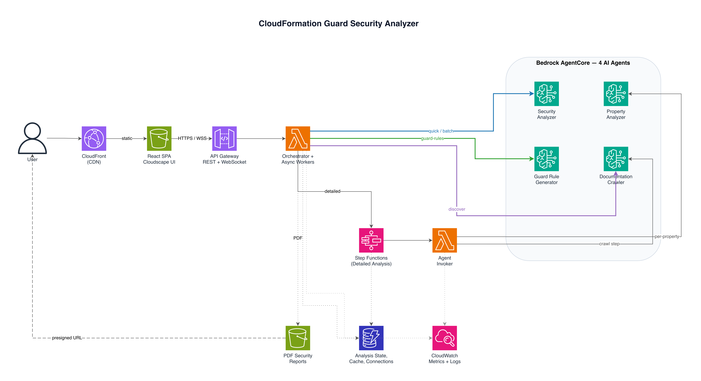
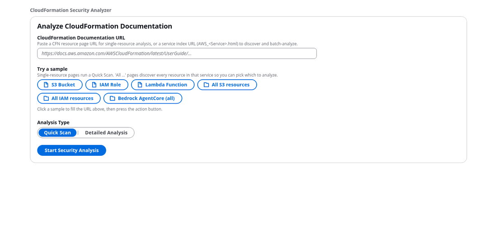

# CloudFormation Guard Security Analyzer

> **Important:** This is sample code for demonstration and educational purposes only. It is not intended for production use without further review and hardening. You should work with your security and legal teams to meet your organizational security, regulatory, and compliance requirements before deployment.

An AI-powered tool that reads AWS CloudFormation resource documentation, identifies security-critical configuration properties, and generates custom [CloudFormation Guard](https://github.com/aws-cloudformation/cloudformation-guard) rules for security hardening. Point it at any CloudFormation resource documentation URL — it assesses risk levels, provides hardening recommendations, and generates ready-to-use Guard rules you can plug into your CI/CD pipeline. Powered by [Amazon Bedrock AgentCore](https://docs.aws.amazon.com/bedrock/latest/userguide/agentcore.html).

## What It Does

[CloudFormation Guard](https://github.com/aws-cloudformation/cloudformation-guard) enforces security policies on CloudFormation templates before deployment. AWS provides an [open-source Guard Rules Registry](https://github.com/aws-cloudformation/aws-guard-rules-registry) with hundreds of managed rule sets mapped to AWS Config rules. However, not all resource properties are covered — new services launch frequently, security best practices evolve, and organizations often need custom rules tailored to their specific compliance requirements.

This tool complements the existing Guard ecosystem by using AI agents to automatically generate custom Guard rules where they don't yet exist:

1. **Scan** any CloudFormation resource documentation and identify every security-relevant property
2. **Assess** each property's risk level (CRITICAL / HIGH / MEDIUM / LOW) with specific threat descriptions
3. **Recommend** security best practices with actionable hardening steps
4. **Generate custom Guard rules** for any identified property — valid cfn-guard 3.x rules with pass/fail test templates, ready to plug into your CI/CD pipeline

## Architecture



| Service | Purpose |
|---------|---------|
| **Amazon Bedrock AgentCore** | Hosts the 4 AI agents (Strands Agents SDK) |
| **Amazon EKS Fargate** | Runs the FastAPI backend service |
| **AWS Step Functions** | Orchestrates the detailed multi-agent analysis workflow |
| **AWS Lambda** | Invokes AgentCore agents from Step Functions |
| **Amazon DynamoDB** | Stores analysis state and WebSocket connections |
| **Amazon S3** | Hosts the React frontend SPA and stores PDF reports |
| **Amazon CloudFront** | CDN for the frontend |
| **Amazon CloudWatch** | Dashboards, alarms, and monitoring |

### How It Works

**Step 1: Security Scan (10-15 seconds)** — Identify security-relevant properties via Quick Scan:

```
User → Frontend → FastAPI (SSE) → Bedrock AgentCore → Security Analyzer Agent
                                                              ↓
                                          ← Property-by-property streaming ←
```

**Step 2: Generate Guard Rules (per property)** — Click "Generate Guard Rule" on any identified property:

```
PropertyCard → FastAPI (POST /guard-rules) → Guard Rule Generator Agent
                                                      ↓
                              ← Guard rule + pass/fail test templates ←
```

The Guard Rule Generator uses [Strands SDK structured output](https://strandsagents.com/docs/user-guide/concepts/agents/structured-output/) to guarantee valid cfn-guard 3.x rules via tool_use schema enforcement. Each rule includes pass/fail CloudFormation templates for local validation with `cfn-guard validate`.

**Optional: Detailed Analysis (2-5 minutes)** — For deeper analysis, the multi-agent workflow via Step Functions:

1. **Crawler Agent** extracts all security-relevant properties from the CloudFormation docs
2. **Property Analyzer Agents** deep-dive each property in parallel (up to 8 concurrent)
3. Progress streams to the frontend via WebSocket in real-time
4. Results are aggregated and a PDF report is generated

## Demo



The walkthrough above shows:
1. **Enter a CloudFormation resource URL** — paste any TemplateReference documentation link
2. **Quick Scan** — 8 security properties identified in ~15 seconds with risk levels and recommendations
3. **Generate Guard Rule** — click the button on any property to generate a cfn-guard 3.x rule with pass/fail test templates
4. **Guard Rules collection** — add rules to a collection tab, download all as a `.guard` ruleset file ready for CI/CD

## Example Output

### Generated Guard Rule

The main output — click "Generate Guard Rule" on any property to get a ready-to-use rule:

```
let s3_buckets = Resources.*[ Type == "AWS::S3::Bucket" ]

rule ensure_s3_bucket_encryption when %s3_buckets !empty {
    %s3_buckets {
        Properties.BucketEncryption exists
            <<S3 bucket must have encryption configured>>
        Properties.BucketEncryption {
            ServerSideEncryptionConfiguration exists
                <<Must specify server-side encryption configuration>>
            ServerSideEncryptionConfiguration[*] {
                ServerSideEncryptionByDefault exists
                    <<Must specify default encryption settings>>
                ServerSideEncryptionByDefault.SSEAlgorithm IN ["AES256", "aws:kms"]
                    <<Encryption algorithm must be AES256 or aws:kms>>
            }
        }
    }
}
```

Each generated rule includes pass/fail CloudFormation templates. Validate locally:

```bash
cfn-guard validate -r rules.guard -d template.yaml
# FAIL → non-compliant template blocked
# PASS → compliant template allowed
```

### Security Analysis (input to rule generation)

The scan identifies which properties are relevant for Guard rules:

```
Resource: AWS::S3::Bucket

  CRITICAL  BucketEncryption
            Threat: Data at rest not protected by encryption
            Fix: Enable SSE-S3 or SSE-KMS encryption

  CRITICAL  PublicAccessBlockConfiguration
            Threat: No explicit public access block configured
            Fix: Set BlockPublicAcls, BlockPublicPolicy, IgnorePublicAcls,
                 RestrictPublicBuckets to true

  HIGH      VersioningConfiguration
            Threat: No versioning protection against accidental deletion or overwrites
            Fix: Enable versioning with MFA delete
```

## Prerequisites

Before deploying, ensure the following:

- **Python 3.11+** and **pip**
- **Node.js 18+** and **npm**
- **Docker** — must be running (for building the service container)
- **AWS CDK v2** — `npm install -g aws-cdk`
- **AWS CLI** — configured with credentials for the target account
- **Amazon Bedrock model access** — [Enable model access](https://console.aws.amazon.com/bedrock/home#/modelaccess) for your preferred foundation model in the deployment region. The default is Claude Sonnet 4, but any Bedrock-supported model works. Without model access enabled, agent invocations will fail with `AccessDeniedException`.

## Deploy

### Option 1: One-command deployment

```bash
git clone https://github.com/aws-samples/sample-cfn-guard-security-analyzer.git
cd sample-cfn-guard-security-analyzer
./deploy.sh
```

The deploy script handles everything: preflight checks, CDK bootstrap, agent deployment, Docker build, infrastructure deployment, and frontend deployment.

### Option 2: Step-by-step

```bash
# 1. Install dependencies
python3 -m venv .venv && source .venv/bin/activate
pip install -r requirements.txt
cd frontend && npm install && cd ..

# 2. Set your account (or export CDK_DEFAULT_ACCOUNT)
#    Edit config.py or set the environment variable:
export CDK_DEFAULT_ACCOUNT=$(aws sts get-caller-identity --query Account --output text)

# 3. Deploy agents (requires: pip install bedrock-agentcore-starter-toolkit)
bash scripts/deploy-agents.sh

# 4. Deploy infrastructure (~20 min for EKS on first deploy)
CDK_ENVIRONMENT=dev cdk deploy --all --require-approval never

# 5. Build and push the Docker image
ECR_URI=$(aws cloudformation describe-stacks \
  --stack-name CfnSecurityAnalyzer-Eks-v2-dev \
  --query "Stacks[0].Outputs[?contains(OutputKey,'EcrRepository')].OutputValue" \
  --output text)
docker build --platform linux/amd64 -t $ECR_URI:latest .
aws ecr get-login-password | docker login --username AWS --password-stdin $(echo $ECR_URI | cut -d/ -f1)
docker push $ECR_URI:latest

# 6. Build and deploy frontend
cd frontend && npm run build && cd ..
aws s3 sync frontend/dist/ s3://$(aws cloudformation describe-stacks \
  --stack-name CfnSecurityAnalyzer-Storage-dev \
  --query "Stacks[0].Outputs[?contains(OutputKey,'FrontendBucket')].OutputValue" \
  --output text)/
```

### Run Locally (development)

```bash
# Backend (requires .env with table names — see .env.example)
uvicorn service.main:app --host 0.0.0.0 --port 8000 --reload

# Frontend (separate terminal)
cd frontend && npm run dev
```

### EKS Cluster Access

To grant `kubectl` access to your IAM user:

```bash
# Set before deploying, or add manually after:
export CDK_ADMIN_USERNAME=your-iam-username
```

Alternatively, use the AWS console to add an EKS access entry for your IAM role.

## Configuration

### Model Selection

The AI agents default to Claude Sonnet 4 (`us.anthropic.claude-sonnet-4-20250514-v1:0`). To use a different Bedrock-supported model, set:

```bash
export BEDROCK_MODEL_ID=us.anthropic.claude-3-5-sonnet-20241022-v2:0
```

This is useful when:
- Your account only has access to specific models
- You want to test with different models for cost or performance
- The default model becomes unavailable in your region

### Multi-Environment

Three environments in `config.py`: `dev`, `staging`, `prod`.

```bash
CDK_ENVIRONMENT=staging cdk deploy --all
```

### Environment Variables

See [`.env.example`](.env.example) for the full list. Key variables:

| Variable | Description | Default |
|----------|-------------|---------|
| `CDK_DEFAULT_ACCOUNT` | AWS account ID for deployment | `111111111111` |
| `CDK_DEFAULT_REGION` | AWS region | `us-east-1` |
| `CDK_ENVIRONMENT` | Environment name | `dev` |
| `CDK_ADMIN_USERNAME` | IAM user for EKS kubectl access | (none) |
| `BEDROCK_MODEL_ID` | Foundation model ID for agents | Claude Sonnet 4 |
| `SECURITY_ANALYZER_AGENT_ARN` | AgentCore runtime ARN (security scan) | (set after agent deploy) |
| `GUARD_RULE_AGENT_ARN` | AgentCore runtime ARN (guard rule gen) | (set after agent deploy) |
| `CORS_ORIGINS` | Allowed CORS origins (comma-separated) | `localhost` |

## Project Structure

```
.
├── deploy.sh                       # One-command deployment script
├── app.py                          # CDK entry point (with cdk-nag)
├── config.py                       # Per-environment config (dev/staging/prod)
├── Dockerfile                      # Multi-stage build for FastAPI service
├── stacks/                         # CDK stack definitions
│   ├── agents_stack.py             #   Bedrock AgentCore agent runtimes
│   ├── database_stack.py           #   DynamoDB tables
│   ├── storage_stack.py            #   S3 buckets + CloudFront
│   ├── stepfunctions_stack.py      #   Step Functions workflow + Lambda
│   ├── eks_stack.py                #   EKS Fargate cluster + ECR + IRSA
│   └── monitoring_stack.py         #   CloudWatch dashboards + alarms
├── service/                        # FastAPI application (runs on EKS)
│   ├── main.py                     #   App creation, CORS, router registration
│   ├── aws_clients.py              #   Singleton AWS SDK clients
│   ├── connection_manager.py       #   In-memory WebSocket connection manager
│   └── routers/
│       ├── analysis.py             #   POST /analysis, POST /analysis/stream
│       ├── reports.py              #   POST /reports/{id} (PDF generation)
│       ├── websocket.py            #   WebSocket connect/subscribe
│       ├── guard_rules.py          #   POST /guard-rules (Guard rule generation)
│       ├── callbacks.py            #   POST /callbacks/progress
│       └── health.py               #   GET /health
├── agents/                         # Bedrock AgentCore agents (Strands SDK)
│   ├── security_analyzer_agent.py  #   Quick security scan agent
│   ├── crawler_agent.py            #   Documentation crawler agent
│   ├── property_analyzer_agent.py  #   Detailed property analysis agent
│   └── guard_rule_generator_agent.py # Guard rule generation (structured output)
├── lambda/                         # Lambda handlers (used by Step Functions)
│   ├── agent_invoker.py            #   Invokes AgentCore agents
│   └── progress_notifier.py        #   Sends progress updates to FastAPI
├── frontend/                       # React + TypeScript SPA (Vite + Cloudscape)
├── scripts/                        # Deployment helper scripts
│   └── deploy-agents.sh            #   Deploy agents via agentcore CLI
└── tests/                          # pytest + Hypothesis + Vitest
```

## API Reference

| Method | Endpoint | Description |
|--------|----------|-------------|
| `POST` | `/analysis` | Start security analysis (quick or detailed) |
| `POST` | `/analysis/stream` | Quick scan with SSE streaming |
| `GET` | `/analysis/{id}` | Get analysis status and results |
| `POST` | `/guard-rules` | Generate a CloudFormation Guard rule for a property |
| `POST` | `/reports/{id}` | Generate PDF security report |
| `WS` | `/ws` | WebSocket for real-time progress (detailed analysis) |
| `POST` | `/callbacks/progress` | Step Functions progress callback |
| `GET` | `/health` | Health check |

## Testing

```bash
# Backend tests (pytest + Hypothesis property-based testing)
pytest tests/unit/ -v

# Frontend tests (Vitest)
cd frontend && npm test
```

## Troubleshooting

| Problem | Cause | Fix |
|---------|-------|-----|
| `cdk deploy` fails with "CDKToolkit not found" | Account not bootstrapped | Run `cdk bootstrap aws://ACCOUNT/REGION` |
| Agent returns `AccessDeniedException` | Model access not enabled | [Enable model access](https://console.aws.amazon.com/bedrock/home#/modelaccess) for your chosen model in your region |
| Agent returns `ResourceNotFoundException` | Model ID is deprecated/invalid | Set `BEDROCK_MODEL_ID` to an active model |
| Pod stuck in `ImagePullBackOff` | Docker image not pushed to ECR | Build and push: `docker push $ECR_URI:latest` |
| Pod can't reach AWS APIs | CoreDNS not running on Fargate | CDK auto-patches this; if stuck, see [EKS Fargate DNS docs](https://docs.aws.amazon.com/eks/latest/userguide/fargate.html) |
| ALB not created for Ingress | Subnets not tagged for LB controller | CDK auto-tags subnets; verify with `kubectl describe ingress` |
| `kubectl` access denied | IAM user not in cluster auth | Set `CDK_ADMIN_USERNAME` env var before deploy, or add an EKS access entry |
| Frontend shows no results | Backend API unreachable (CORS/mixed content) | Update `frontend/src/config.ts` with your ALB endpoint; use HTTPS on ALB |
| `npm run build` fails in frontend | Missing `@types/node` | Run `npm install` in the `frontend/` directory |

## Cleanup

```bash
# Destroy CDK stacks
CDK_ENVIRONMENT=dev cdk destroy --all

# Destroy AgentCore agents
agentcore destroy --agent cfn_security_analyzer --force
agentcore destroy --agent cfn_crawler --force
agentcore destroy --agent cfn_property_analyzer --force
agentcore destroy --agent cfn_guard_rule_generator --force
```

## Security

See [CONTRIBUTING](CONTRIBUTING.md#security-issue-notifications) for reporting security issues.

## License

This library is licensed under the MIT-0 License. See the [LICENSE](LICENSE) file.
